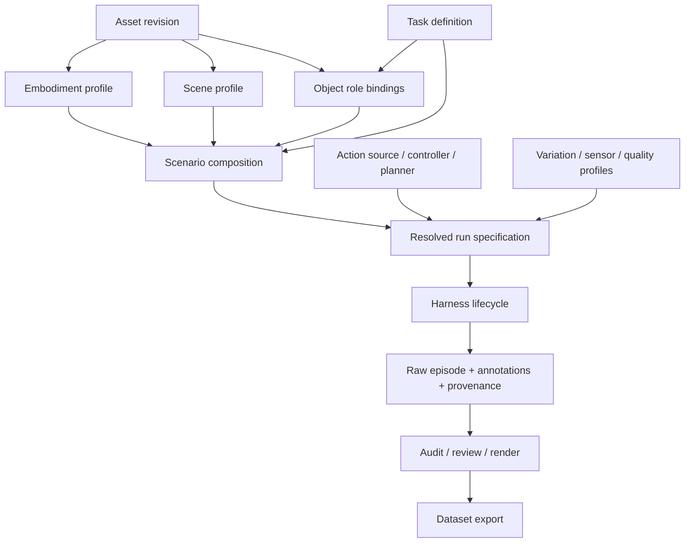

# Harness 架构与扩展契约

本文是目标设计，不是当前已生效 API。基线与证据范围见 [索引](README.md)。

边界确认：Harness 是 Arena 上的数据生成管线。Catalog 只索引采集配置；Scenario 引用已有
Arena 工厂/注册名；Simulation/Control adapter 连接现有环境与动作接口，不创建另一套
仿真、机器人、资产、任务或控制框架。首版借助子进程薄适配接入现有采集器，逐步迁移重复管线逻辑。

## 1. 底层选择

| 候选 | 适合复用的部分 | 不能直接成为通用底层的原因 |
|---|---|---|
| Arena environment / env.step / recorder hooks | 场景组合、控制步、动作处理、状态记录、终止与 reset | 需要补统一采集生命周期、产物身份、审核和质量契约 |
| G2 Session + CLI | 分阶段入口、独立任务审计、原始数据与视频哈希关联、原子导出 | 写死 G2 动作、相机、任务分支，且运行入口面向 Docker |
| Pine WM qualify | 工作区、相机与碰撞检查、单次预览审核、sub-stage 试点 | 大量局部状态与机器人假设，预览为 post-step |
| RR collectors | 批次组织、历史数据兼容、资产方法对比、训练格式转换 | 任务专用脚本、历史时间契约与导出规则需要保留而非套用新标签 |

选择第一项作为首个仿真适配底层，其他能力按职责吸收。不另写一套物理引擎，不把 G2 控制向量
改成可变长度就称为通用。核心模型/注册/校验应可在普通 Python 中读取，不因列任务而启动 Isaac Sim。

首期运行组合为 Isaac Sim / Isaac Lab / Arena + PhysX GPU。cuMotion 是首个规划适配器，
不拥有采集时钟；teleop、脚本、远程策略也能提供动作。Newton 等物理后端按能力单独适配验证，
不能把 Arena 已有枚举视为 harness 已经完成支持。

## 2. 领域模型：组合关系，而非目录继承

用户浏览仍可采用“场景 → 任务 → 资产”。数据模型采用引用：一个机器人可用于多个场景，
一个任务语义可绑定多个场景，同一资产可被多个任务引用。兼容性通过能力校验，不生成所有组合。

| 实体 | 拥有的内容 | 不拥有的内容 |
|---|---|---|
| AssetRevision | 不可变 payload、依赖闭包、单位/尺度、物理类型、关节/可交互部位、碰撞与材质版本 | 某次任务的初始位置、episode 输出 |
| EmbodimentProfile | 身体/工具/传感器安装结构、关节组、动作空间、TCP、碰撞模型、控制能力 | 工作台布局、某个任务的成功判据 |
| SceneProfile | 桌面/房间/固定设施、参考坐标系、工作区、禁入区、固定相机与灯光 | 所有可能出现的任务物体、特定机器人动作向量 |
| TaskDefinition | 目标语义、角色要求、前置条件、成功/失败/稳定保持判据、指令模板 | 固定资产文件路径、默认必须使用某种求解器 |
| ScenarioSpec | 选择场景/机器人/任务，角色绑定对象实例，机器人安装位姿、相机标定、初始布局 | 批次重试与进程管理 |
| Skill / Recipe | 操作阶段、参数、动作来源、恢复分支、阶段证据 | 最终任务成功的唯一裁判、存储格式 |
| CollectionProfile | 模态、频率、随机化、质量阈值、设备要求、失败数据保留、导出目标 | 可被悄悄改变的资产和标定 |
| Run / Attempt / Episode | 解析后配置、采样结果、执行记录、指标、版本、产物与审核引用 | 新的可变配置默认值 |

关键细节：

- `pine_wm` 优先表示场景；现有 `pine_wm_ur7e` 保留为已验证组合/别名，不直接重命名破坏消费者。
- G2 是 embodiment 家族，不应把叠碗、插销、清理台全部当作一个名为 G2 的场景。
- 固定相机属于 scene；腕部相机的安装结构属于 embodiment；两者在 scenario 中共同确定最终标定。
- 工具更换会影响 TCP、碰撞及控制能力，必须形成显式配置版本，不能仅替换视觉 USD。
- task 中 `object`、`target`、`handle` 等是角色；scenario 将角色绑定到稳定 instance ID。
  Asset ID、instance ID、角色名、USD prim path 分开保存，多个同型号杯子不能共用实例身份。
- 替换抽屉资产要验证关节方向、行程、把手、尺寸、接触及可达性；有“drawer”标签不代表兼容。
- 专用操作可以保留在任务适配器；只有经跨任务验证的操作才提升为公共 skill。

新 ID 建议带命名空间，如 `scene/pine_wm`、`task/pick_place`、`scenario/pine_wm/T001`。
这些是目标命名示例；现有 T001、环境名、HF manifest ID 通过显式映射兼容，不直接批量改名。

## 3. 完整扩展面

| 扩展点 | 插件/适配器需要声明 | 系统需要验证 |
|---|---|---|
| Embodiment / end effector | 关节、单位、控制组、工具、TCP、碰撞和附载 | 动作映射、FK、初始姿态、相机支架与载物碰撞 |
| Scene / scenario | 坐标系、安装位姿、工作区、相机、布局与接触设施 | 尺寸、视野、完整任务扫掠范围、初始穿透 |
| Task / goal | 对象角色、前置/成功/失败条件、超时、独立审计 | 成功谓词与实测证据一致；结束不等于成功 |
| Asset / variant | 依赖、物理描述、交互部位、来源与许可、版本 | 引用闭包、尺度、关节、材质、碰撞资格 |
| Skill / recipe | 输入/输出条件、阶段、重试/恢复、预期接触 | 记录所有已执行路径，不删除失败阶段 |
| Action source | 脚本、规划、teleop、策略、回放，命令格式与时间 | 原始意图与实际执行命令区分；切换来源有记录 |
| Controller / planner | joint/EEF/velocity/effort 等动作语义、频率、约束 | 不将位置下一帧当动作，不绕过控制步记录 |
| Physics backend | 刚体、关节、柔性、接触、状态快照能力及 device | 仅允许已验证组合；不静默换物理实现 |
| Sensor / modality | RGB、深度、分割、力、触觉、点云等形状/单位/时钟 | 原始时间戳、有效掩码、丢帧、标定和外参链 |
| Randomization / curriculum | 布局、物理、外观、任务参数的分布和约束 | 可行域与实际接受分布；变化不能破坏任务语义 |
| Annotation | task/skill/stage/event、对象、来源、版本、证据 | 区间覆盖、主体关联、未知标签和修订溯源 |
| Quality / acceptance | 数值、物理、可视、设备、数据合同及人工审核 | pass/fail/unknown 分开；不能以单一 success 代替 |
| Recorder / state codec | 转移、终止前状态、物体状态、插件状态 | 可采集与可重放分别声明，不能遗漏柔性/控制器隐状态 |
| Renderer / exporter | live/replay、输出格式、转换和裁剪映射 | 来源哈希、时间与模态一致、完整解码、原子产物 |
| Runtime / scheduler | native/container、GPU、资源预算、取消/恢复 | GPU 占用、租约、超时、失败隔离、幂等性 |
| Dataset composition | episode 选择、混合权重、拆分、格式版本 | 防数据泄漏；动作/模态不兼容不能强行拼接 |
| Review / observability | 网页/CLI、审核版本、阶段耗时、失败原因 | 同一 manifest 驱动视图，不靠扫目录推断完成 |

“支持所有训练场景”意味着扩展接口没有预设单臂/刚体/固定相机限制；实际支持范围由能力矩阵决定。
单臂桌面、双臂协同、移动操作、多机器人、灵巧手、柔性接触、动态物体/传送带、工具操作分别验证。
不支持的组合在 preflight 给出缺失能力；首期不承诺实现所有传感器和所有物理后端。

## 4. 模块边界与运行接口

目标核心放 `isaaclab_arena/collection/`，复用已有 `recording/`、`annotations/`、environment 和 registry。
不在 `isaaclab_arena_cumotion/g2_collection/` 下建立通用核心；该目录是 G2 适配来源。
不创建平行的机器人/资产注册系统：轻量 profile 引用已有注册名，运行时再加载相关工厂。

| 目标职责 | 最小接口语义 |
|---|---|
| Registry / resolver | 从引用解析不可变 RunSpec；检查版本、能力、依赖和配置冲突 |
| BackendAdapter | 创建环境、reset、读取终止前状态、执行一个控制转移、关闭；暴露实际 dt/device |
| ActionSource | 按 observation 产生 command；支持 reset/cancel；异步来源记录时延与 stale 状态 |
| ControllerAdapter | command → applied control；声明插值、限幅、保持和 action channel 映射 |
| TaskAdapter | 提供初始条件、在线判定、离线证据审计；分别报告终止与成功 |
| Recorder | episode begin、pre-step、post-step、terminal、abort；写入完整转移和不完整事件 |
| StateCodec / CaptureAdapter | 保存物理/控制状态和传感器；声明能否完整恢复、是否允许离线重渲染 |
| Validator / Exporter | 读取不可变 episode 和依赖产物，产生带来源与版本的报告/派生数据 |
| Runner / review service | 驱动状态机、资源、日志和审核；不包含机器人 IK、对象尺寸或成功阈值 |

只有 BackendAdapter 所属的执行通道推进物理/控制时钟。首个适配器通过 Arena `env.step` 和官方
recorder hooks 连接记录器；需要终止前快照时在对应 hook 获取，避免 Gym 自动 reset 后读取新场景。
`EnvActionExecutor` 可以复用轨迹到环境动作的执行逻辑，但必须走同一个受记录通道。
直接 `sim.step` 的历史驱动先留在 legacy adapter；不可在主循环外推进后宣称数据完整。
实现时确认 hooks 与包装层没有重复记步，不继续叠加多个 monkey-patch。

首期保持一进程一个 simulator、每 worker 一个 env。schema 预留 `env_id`、`actor_id`、episode 独立
计数；向量环境需要另外验证异步 reset、终止边界和 writer 隔离。双臂协作不一定有两份 env.step：
一个全局控制步可有多个 actor 的技能区间，闲置手臂用显式 hold/idle 或有效掩码表示。

## 5. 数据、时间与标注合同

基础事实关系是 `observation_t + command_t → next_state_t`，skill/stage 标签对应这个动作转移。
保存初始状态和每步后状态可表达 T+1 个状态点，不要求在物理存储中重复两份完整数组。

- command 与 applied control 分开；控制器在 substep 内变化时记录其轨迹或充分的控制参数。
  UR7e 当前“最后一个 substep 的目标”是一种已声明标签，不自动代表整个控制区间。
- episode 记录实际 control_dt、physics_dt、decimation、时间原点、动作保持规则及数据 schema。
- 同频训练投影要求 T 个 action/observation/label/image；异频传感器保存原生时间戳和
  `sample_index → transition_index` 映射，插值/采样/丢帧策略显式记录，不能要求所有原生流等长。
- 保存 frame tree、四元数顺序、TCP 定义及每个字段的单位/参考系；6D rotation 和归一化属于派生转换。
- scene state 包含机器人、刚体、关节物体及后端所需隐状态。柔性节点、控制器状态、随机状态或接触
  缓存不完整时标明 replay 能力，不能从刚体 pose 推断精确重放能力。
- `episode_success`、`terminated`、`truncated`、`abort_reason`、`quality_valid` 分开。
  合法失败轨迹可供恢复学习/RL 使用；是否进入某一数据集由 selection profile 决定。
- 标注复用 `arena.skill_trace.v1` 的思想，完善 actor/channel 和多流时间映射；不静默修改现有 v1 含义。
  人工修订另存版本、来源和审核记录。策略/teleop 没有阶段证据时保持 unknown，不能自动编造标签。
- raw 封存后不可变；后续标签、质量审核、视频和训练格式由 raw hash 关联。已有 HDF5 内嵌标签
  可作为初始标注快照，修订不原地修改 raw，也不导致所有已验证视频失去来源身份。

## 6. 图像获取、质量及 CUDA

支持三种明确命名的产物：

1. live pre-action training capture：优先验证的新训练路线；需确认 sensor 数据新鲜度与状态一致，
   不能仅因函数名有 pre-step 就宣称相机刷新正确。
2. states-first replay：用于降低采集开销/改变外观；需声明 exact 或 bounded、记录漂移及来源映射。
   现有 G2 微步回放属于 bounded；不默认用于精密插入/快速接触任务，由任务质量 profile 决定容差。
3. post-step preview：现有 Pine WM 审核视频继续保留；明确可视化用途，不直接伪装成 pre-action 训练图像。

质量由通用结构校验、机器人校验、任务物理校验、传感器/可视校验、运行设备校验组成。
相机视锥覆盖不代表无遮挡，图像有运动不代表与正确状态同步；需要关键阶段检查和必要的几何证据。

当前项目选择严格 GPU profile：物理、碰撞、求解/规划、渲染必须逐项证明所用 device；编码另记
NVENC/其他后端。CPU 日志、JSON、调度不属于物理/渲染 GPU 声明。`requested=cuda:0` 不是验证证据。
每个组件记录 requested/observed/evidence/pass-fail-unknown；unknown 不授予严格资格。
G2 bin 的 CPU fallback 已于 2026-09-27 完成专项修复；native planner device 未验证仍是阻塞项，不能以任务成功绕过。

## 7. 随机化与批量质量

采样应覆盖布局、姿态、数量、资产实例、摩擦/质量、外观/光照、允许变化的相机及语言条件。
实机标定默认锁定，相机扰动需独立实验配置。场景核心工作区是优先采样区域，不是所有任务共用
的一个矩形；堆叠高度、抽屉完整拉伸、工具扫掠、双臂交汇及载物外形都进入约束。

保存每个随机子流 seed、候选样本、拒绝原因、最终实例化值、布局解析版本。报告采样接受率与
条件成功率，防止“只采到简单位置”导致表面稳定。数据划分按资产/场景/随机化来源分组，避免同一
轨迹的多视角、重渲染版本或近重复布局跨 train/test 泄漏。

## 8. 两个独立生命周期

资格流程：`registered → preflight_passed → preview_success → review_approved → stability_passed → collection_enabled`。
每项任务先一个成功预览，等待用户确认后才进入稳定性；attempt budget 达到即停止，无无限自动试错。
审核绑定 scenario/资产/控制/传感器/随机化/判据版本；相关变化使对应资格失效，纯文档变化不触发重跑。

执行流程：`planned → collecting → raw_sealed → audited → captured_or_rendered → validated → exported`，
live capture 可与 collecting 同时完成。各阶段允许 failed/cancelled；不是把异常都归为 task_failure。
区分 asset/runtime/planning/control/contact/task/recording/render/export 等失败层，保留诊断材料。

attempt_id 每次执行唯一，失败也有身份；episode_id 只绑定该次物理记录。重试不覆盖旧目录。
阶段幂等键由输入哈希、适配器版本、解析配置决定；lease/锁防两个 worker 写同一目标。
临时产物通过校验后原子提交。崩溃优先从封存 raw 恢复渲染/导出；没有完整 simulator checkpoint
时不承诺恢复到轨迹中间。取消先尽量封存完整转移，再标注不完整边界并释放资源。

网页和 CLI 读取同一 run manifest / index，展示任务审核状态、阶段耗时、失败原因、随机化覆盖、
设备验证、四路/三路或其他模态及标注；不再用“发现 MP4 文件”等价于采集完成。

## 9. 存储、版本与发布

Git 放代码、schema、任务/标定/控制配置、小型适配层；HF `USDCraft-Scene` 放版本化资产依赖。
对象保持 `assets/`，机器人保持 `embodiments/`，场景保持 `scenes/`，互相引用而不复制 payload。
Git-owned 配置在 HF 中的快照仅用于追溯，不是另一份可独立编辑的真值。
本机默认资产缓存仍为 gitignored `local_assets/USDCraft-Scene`；不同 revision 同时使用时单独目录。

raw、视频、训练集、checkpoint、缓存与运行日志不进 Git；训练数据若发布应使用独立数据仓库。
记录 code commit + dirty source digest、资产 revision + 文件哈希、runtime/backend/driver 版本、
传感器标定、随机化结果、转换链和审核身份。HF 更新不自动覆盖活动 run 的依赖。

LeRobot/Zarr 等 exporter 只消费规范化 episode view，不各自猜测截尾或成功状态。
新格式升级先写新版本，保留旧 episode/帧映射；跨 embodiment 混合训练通过显式 action/state
投影、模态掩码与 robot ID 完成，不用补零冒充同一种控制语义。

## 10. 首期边界

首期交付单机、单 worker 顺序执行和 Pine WM/G2/RR 适配，完成统一合同与人工预览闭环。
不同时建设分布式平台、新标注算法、全自动任务生成或训练调度系统。
后续扩展预留明确接口，但必须通过 capability tests 才显示为 supported。
