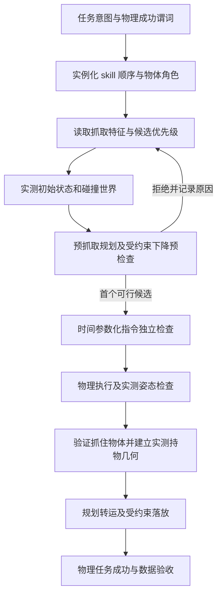

# 从任务描述到 cuMotion 执行：配置、选择与检查

cuMotion 不会从“叠三个碗”自动决定抓哪个碗、用哪只手、抓哪一侧。
这些是任务策略层的决定；规划器接收具体关节状态、目标位姿和碰撞世界。
之前这些决定混在 Python recipe 中，因此无法在执行前清楚审核。

## 现在可以直接查看什么

```bash
# 静态解释，不启动 Isaac Sim，不占 GPU，不代表 IK 已通过。
.venv/bin/python -m data_engine.cli.harness explain --scenario g2/stack_bowls
```

叠碗配置：`data_engine/g2/task_plans/stack_bowls.json`。
配置被冻结到 run spec 的 `scenario.task_plan`，文件本身也在 source SHA256 清单中。
实际选择写入每条运行的 `payload/raw/decisions.json`，网页“任务拆分、抓取候选与规划检查”
显示接受／拒绝结果和理由。`report.json` 还保留阶段边界和运动检查统计。
这些字段是审计证据，不是自动审批或训练资格。

## 一条任务经过的步骤



候选列表有限；全部拒绝就结束，不改变约束来执行。选择阶段不执行候选动作。
完整任务不是一次性全部规划：闭爪、实际抓取偏差、持物姿态只有物理执行后才能知道，
因此转运和放置使用当时实测状态重新规划。配置中的 `selection_scope` 明确这一边界。

## 配置归属

| 层 | 决定什么 | 当前位置 |
|---|---|---|
| 任务定义 | 目标、对象角色、成功谓词 | Arena task + `data_engine/g2/tasks.json` |
| 任务计划 | skill 次序、手臂、来源/目标、候选、阶段约束、物理检查阈值 | `data_engine/g2/task_plans/stack_bowls.json` |
| skill 实现 | 阶段状态转换、闭爪与持物测量、何时触发重规划 | `data_engine/g2/collection/recipes.py` |
| 机器人适配 | TCP、关节、夹爪语义、完整碰撞球及既有忽略对 | `data_engine/motion/embodiments/` |
| 规划后端 | 自由空间图规划、局部 IK + cuMotion 关节路径组成的接近路径 | `data_engine/motion/cumotion/planner.py` |
| 独立运动检查 | 规划路径、实际下发指令、实测刚体姿态 | `data_engine/motion/cumotion/safety.py`、`executor.py` |
| 运行合同 | 资产版本、配置和源码哈希、seed、单次尝试及证据 | `data_engine/harness/` |

task plan 的阶段列表描述 skill 的执行结构；不是任意编排 Python 功能的通用 DSL。
新 skill 仍需提供具体实现和成功验证。其他未迁移的任务会明确显示 `legacy_recipe`，
不能因为有统一入口就声称所有任务已声明式化。

## 为什么原来抓朝向身体的一侧

旧配方对左右手均硬编码 `yaw=0`，偏移是 `[-0.065, 0, 0]`；这只是已有 recipe 的
选择，并非 cuMotion 比较候选后认为该侧最优。

叠碗场景桌面坐标：+x 朝远离机器人方向，+y 朝机器人左侧，桌面 z=0。
新优先级如下；“左右”以机器人为准，不以某一路相机画面为准：

| 手臂 | 优先抓取碗沿 | 候选 yaw | 首选世界偏移 |
|---|---|---|---|
| 右手 | 右侧/外侧 | 90°, 60°, 120° | `[0, -0.065, 0]` m |
| 左手 | 左侧/外侧 | -90°, -60°, -120° | `[0, +0.065, 0]` m |

位置由配置里的径向公式计算，工具朝向为 `Rz(yaw) * Rx(pi)`。
策略是按优先级选择第一个通过“预抓取 + 直线下降”检查的候选，不是假称全局最优。
候选来自人工定义的碗沿特征，并非视觉网络自动生成。没有执行到的备选不能算已验证。
推广到新机器人时应重新定义手臂侧、TCP/夹爪坐标及可达性，不能直接复制这些角度。

## 新增的检查实际检查到哪里

- 图规划返回后：独立 inspector 检查关节限位和自碰撞，关节空间采样最大间隔 0.02 rad。
- 接近／提起／落放／退出：局部目标间隔不超过 10 mm，固定工具朝向；FK 必须保持在
  3 mm 的有限直线走廊内，角度误差不超过 5°。失败不会回退成自由空间绕行。
- 执行之前：检查时间参数化后真正将下发的全部命令，并细分命令间的关节间隔。
- 执行过程中：每个 control step 后，使用所有相关刚体的实测位姿重新变换碰撞球。
  包括实测非活动手臂、头部和夹爪，不依赖规划时固定关节的旧姿态。
  球对距离运算在环境的 torch device 上执行，CUDA 仿真时即为 CUDA。
- 跟踪补偿：外侧抓取的持物负载会造成稳定的毫米级 TCP 偏差；配置允许最多两次实测残差补偿，
  总量不超过 3 mm。补偿指令和实际轨迹仍须通过原始走廊、自碰撞和 2 mm 终点误差检查，
  不改变执行器增益或容差；名义目标与补偿后指令目标分别记录。
- 闭爪前：碗相对初始位置扰动超过 5 mm 就停止；不能把推走碗之后的补偿当成正常接近。
- 抓取后：实际抬升超过 100 mm，才按实测物体/TCP 相对位姿建立持物球模型。

球模型是几何近似。0.02 rad 密集采样和每个控制步检查不等同于连续扫掠证明，
也不能据此声称所有 PhysX 子步都没有接触。没有扩大既有自碰撞忽略对。
场景碰撞仍由 cuMotion 障碍物模型及任务原有检查负责；G2 intended-contact 对象
暂时仍是对象级规划排除，并非已实现任意 link/object 接触白名单。
底层原生 planner 的计算设备仍需独立证明；不能把实测碰撞检查使用 CUDA
扩大为整个原生求解器已被证明全 CUDA。

## 审核与采集顺序

1. 查看 explain，确认任务拆分、手臂/对象角色、抓取候选和接近约束。
2. 单次 preview：候选规划→实际执行→视频与报告；失败证据保留，不自动批量重试。
3. 查看选中候选、拒绝原因、阶段记录、三路视频及物理成功证据，调整任务。
4. 用户确认动作后再单独进入随机布局稳定性测试；通过后才授予批量采集资格。

`explain` 不是新的 Sim-based prepare 命令：实际 IK/路径候选检查目前在 preview 内执行，
并在第一条动作下发前写 decisions。若要在两者之间加入人工审批，应将该准备结果另行
封存成 prepare artifact；现在不假称已经有这个生命周期状态。


## 2026-09-27 实测验收

- 新叠碗 `g2_stack_safety_20260927_03`：1170 帧，三路视频和 LeRobot 导出通过，
  右手首选 +90°、左手首选 -90° 均通过。两只碗分别抬升约 153 / 156 mm。
  实测碰撞球最小间隙约 65.8 mm；规划/指令/实测关节配置检查 6143 次，
  实测刚体球对检查 2186 次，无拒绝。计数包含执行器和任务层检查，不等于独立帧数。
  worker（采集+回放+导出）265.60 秒。未追加成功率试验。
- 失败记录 `_01` 保留只读 native FK 数组接口问题；`_02` 保留外侧抓取负载导致
  2.46 mm 残余误差。`_03` 使用有界补偿通过，未放宽 2 mm 终点误差阈值。
- 对旧成功记录第 340 帧的真实关节姿态做回归：新公共检查明确拒绝
  `arm_r_link4/5` 与 `head_link3` 重叠；不是只验证一个人工构造的测试样例。
- Pine T041 `pine_t041_safety_20260927`：共享执行器回归成功，280 帧、四路相机，
  抽屉打开 99.88 mm，无禁止接触，worker 82.31 秒。Pine 保留已有线性接近与场景接触检查。
- 新旧 run 原文件不覆盖。报告与测试证据放在 gitignored
  `outputs/harness/g2_motion_safety_20260927/`；网页按 run ID 查阅。

网页阶段按钮由 collector phase 边界按 15 Hz 生成，可直接跳到接近、闭爪、提起等阶段。
这些预览阶段明确标记 `collector_phases_preview_only`，不伪称 G2 已完成 HDF5 的通用
SkillTrace 标注迁移。插销和工作台的声明式 task plan 仍未迁移，返回 `legacy_recipe`；
工作台已接入公共自碰撞硬检查，但此轮没有重跑其整条任务，也没有宣布旧危险路径已调好。
